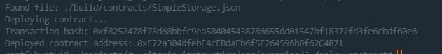

# Task 2: Deploy A Simple Ethereum Smart Contract On Polyjuice

## 1.A screenshot of the console output immediately after you have successfully deployed a smart contract.

## 2.The transaction hash from the contract deployment (in text format).

0xf8252478f78d68bbfc9ea584045438786655dd01547bf18372fd3fe6cbdf60e6

## 3.The deployed contract address from the contract deployment (in text format).

0xF72a304dfebF4cEBdaEb6f5F264596b8f62C4871
