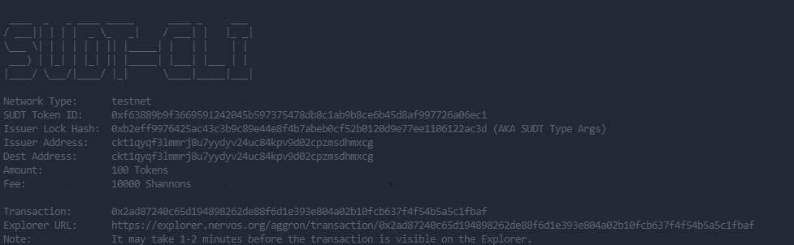
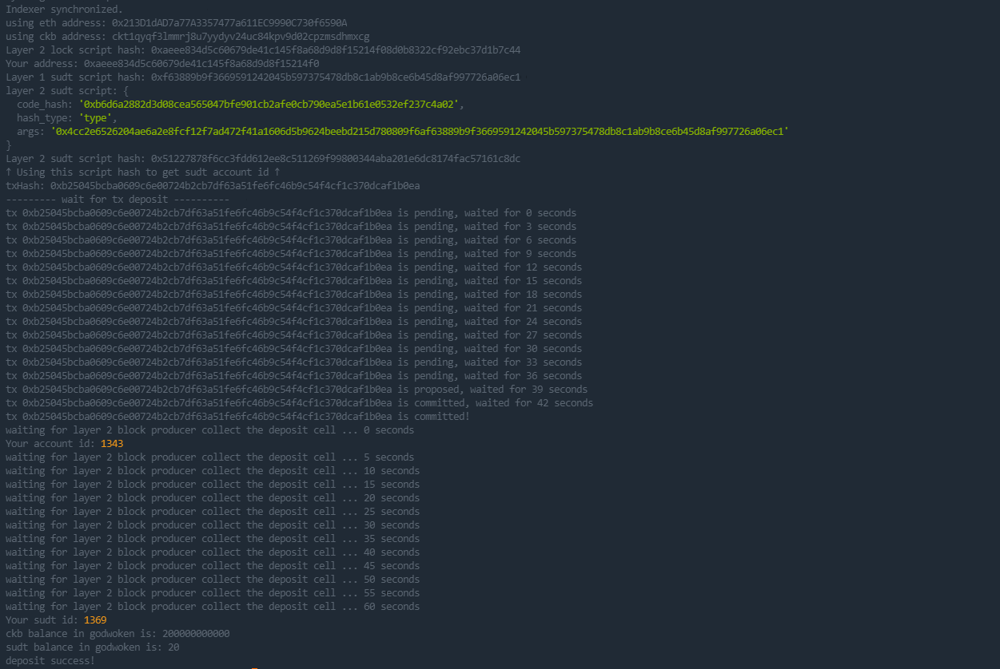

# Gitcoin: 4) Issue An SUDT Token On Layer 1 And Deposit It To Layer 2

## 1.A link to the Layer 1 address you funded on the Testnet Explorer.

https://explorer.nervos.org/aggron/address/ckt1qyqf3lmmrj8u7yydyv24uc84kpv9d02cpzmsdhmxcg

## 2.A screenshot of the console output immediately after using sudt-cli to create your SUDT tokens on Layer 1.

## 3.A link to the transaction ID created by sudt-cli on the Testnet Explorer.

https://explorer.nervos.org/aggron/transaction/0x2ad87240c65d194898262de88f6d1e393e804a02b10fcb637f4f54b5a5c1fbaf

## 4.A screenshot of the console output immediately after you have successfully submitted a deposit to Layer 2 using the account-cli tool.

## 5.The SUDT ID from the console output after executing the deposit script (in text format).

SUDT ID: 1369
