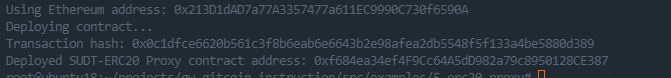
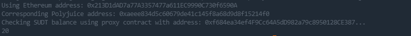

# Gitcoin: 5) Deploy The ERC20 Proxy Contract For The Deposited SUDT

## 1.A screenshot of the console output immediately after deploying smart contract.

## 2.The address of the ERC20 Proxy Contract you deployed (in text format).

0xf684ea34ef4F9Cc64A5dD982a79c8950128CE387

## 3.A screenshot of the console output immediately after checking your SUDT balance.

## 4.The Ethereum address that was checked (in text format).

0x213D1dAD7a77A3357477a611EC9990C730f6590A
