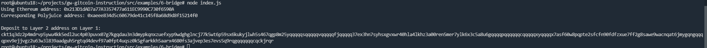

# Gitcoin: 6) Use Force Bridge To Deposit Tokens From Ethereum To Polyjuice

## 1.A screenshot of the console output immediately after you have successfully generated your Deposit Receiver Address.

## 2.Your Deposit Receiver Address (in text format).

ckt1q3dz2p4mdrvp5ywu4kk5edl2uc4p03puvx07g7kgqdau3n3dmypkqnxzuefxyp9wdghglncj77k5wt6p59sx6kukyjlwh5s467qgp8m25yqqqqqsqqqqqvqqqqqfjqqqqq37ex3hn7syhsxgvxwr40hla4lkhz3a00ren5mer7ylk6x3c5a8u6gqqqqpqqqqqqcqqqqqxyqqqqx7asf60w8pqpte2sfcfn90fdfzxue7ff2g8sawe9wacnqat6jmygqngqqqqpxv9ejjvgz2u63w3l839aadguh5rgtqd4devf97a0fpt4uqsz0k5gfarkkh5aarx4680fs3ajvep3es7evs5q9rqgqqqqqqcqckjrqr

## 3.The Ethereum address used to generate the Deposit Receiver Address (in text format).

0x213D1dAD7a77A3357477a611EC9990C730f6590A

## 4.A link to the Etherscan explorer for the successful Force Bridge transaction. This can be found on Force Bridge under History→Succeed.

https://rinkeby.etherscan.io/tx/0x7a1483df081fcb11b19b555d0b11f901bdf83f96a6d6e825c7f5c0ef87372378

## 5.A link to the Nervos explorer for the successful Force bridge transaction. This can be found on Force Bridge under History→Succeed.

https://explorer.nervos.org/aggron/transaction/0x8cc09cac172f82e9bd988fe4700979143ba9ec676fd623d6ebeff2cdfca96734
