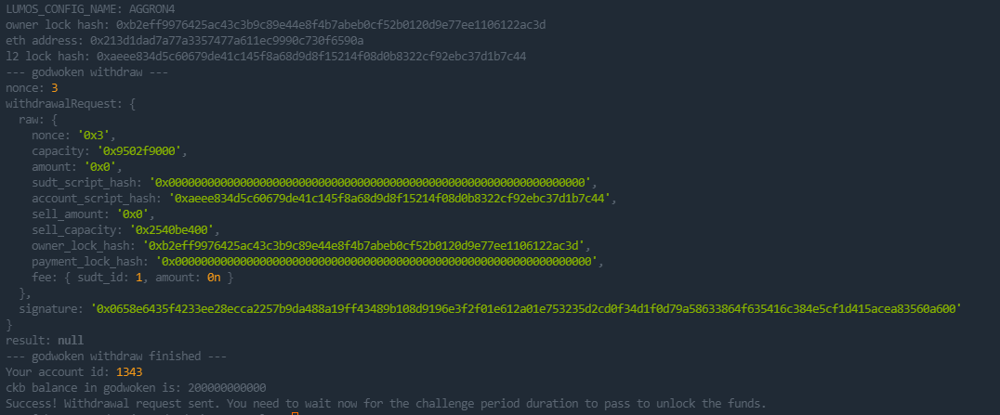

##Gitcoin: 9) Initiate Withdrawal Process From The Layer 2 Back To Layer 1

## 1.A screenshot of the console output immediately after running the withdraw command.

## 2.The Ethereum address that you've used for your Layer 2 account (in text format).

0x213D1dAD7a77A3357477a611EC9990C730f6590A

## 3.The Nervos Layer 1 address that you passed to withdraw command (in text format).

ckt1qyqf3lmmrj8u7yydyv24uc84kpv9d02cpzmsdhmxcg
